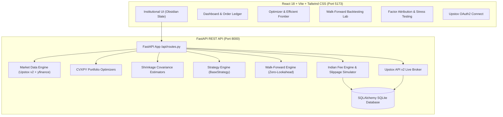

# QuantDesk: Institutional Quantitative Portfolio Optimization & Live Paper Trading Platform

[](https://www.python.org/)
[](https://fastapi.tiangolo.com/)
[](https://react.dev/)
[](https://vitejs.dev/)
[](https://tailwindcss.com/)
[](https://www.cvxpy.org/)
[](https://upstox.com/developer/api-documentation/)
[](https://opensource.org/licenses/MIT)

A production-grade Quantitative Portfolio Optimization, Walk-Forward Backtesting, and Live Paper Trading platform engineered specifically for **Indian Equities (NSE / Nifty 50)**.

Designed with an institutional dark-mode fintech interface (`#080C14` Obsidian canvas, `#0D1322` cards, `#1A263D` borders, and `#3B82F6` $\to$ `#10B981` electric emerald branding), high-precision convex optimization solvers, realistic Indian transaction fee modeling (STT, exchange turnover, GST, SEBI turnover fees, square-root market impact slippage), and zero-downtime hybrid broker execution.

---

## Architecture Overview



---

## Core Capabilities

### 1. Six Quantitative Portfolio Optimizers
1. **Minimum Variance**: Convex quadratic program (QP) via CVXPY with single-asset and sector constraints.
2. **Maximum Sharpe Ratio**: Quadratic program maximizing risk-adjusted return against the Indian sovereign risk-free benchmark ($R_f = 6.5\%$).
3. **Risk Parity (Equal Risk Contribution - ERC)**: Spinu (2013) convex formulation equalizing marginal risk contributions across assets:
   $$RC_i = w_i \frac{(\Sigma w)_i}{\sqrt{w^T \Sigma w}} = \frac{\sigma_p}{N}$$
4. **Hierarchical Risk Parity (HRP)**: Machine-learning tree clustering on correlation distance matrices, quasi-diagonalization, and recursive bisection without matrix inversion.
5. **Black-Litterman Model**: Blends market equilibrium priors ($\Pi = \lambda \Sigma w_{mkt}$) with active investor views ($P, Q, \Omega$) to derive Bayesian posterior returns and covariance.
6. **CVaR (Expected Shortfall) Optimization**: Rockafellar-Uryasev (2000) linear program minimizing conditional tail losses at $95\%$ confidence.

### 2. Four Robust Covariance Shrinkage Estimators
1. **Sample Covariance**: Empirical covariance annualized by 252 trading days.
2. **Ledoit-Wolf Shrinkage**: Analytic shrinkage toward a constant-correlation target, preventing ill-conditioned matrices when $N \approx T$.
3. **Random Matrix Theory (RMT) Cleaning**: Marchenko-Pastur eigenvalue spectrum filtering, stripping noisy empirical eigenvalues while preserving matrix trace.
4. **3-Factor Structured Covariance**: Systematic risk decomposition (Market, Size/SMB, Value/HML) with diagonal idiosyncratic noise:
   $$\Sigma = B \Sigma_F B^T + \text{diag}(\sigma_{\epsilon}^2)$$

### 3. Indian Market Microstructure & Fee Engine
Simulates authentic Indian broker statutory charges and liquidity consumption:
- **Brokerage**: $\min(0.03\% \times \text{Turnover}, ₹20)$ per executed order.
- **Securities Transaction Tax (STT)**: $0.1\%$ on delivery sell turnover.
- **Exchange Turnover Charges**: $0.00345\%$ (NSE) + $18\%$ GST on (brokerage + exchange charges).
- **SEBI Turnover Charges**: $₹10$ per crore ($0.0001\%$) + Stamp Duty ($0.015\%$ on buy delivery).
- **Square-Root Market Impact Slippage**:
  $$\text{Slippage} = \gamma \cdot \sigma_{\text{daily}} \cdot \sqrt{\frac{\text{Order Shares}}{\text{ADV}_{30}}}$$
  where $\gamma = 0.1$.

### 4. Zero-Downtime Hybrid Broker Routing
- **Upstox API v2 OAuth2**: Automated authorization code flow, secure token persistence, token refresh, and live portfolio sync.
- **Paper Trading Engine**: When offline, outside market hours, or when credentials are not configured, orders route automatically to the high-precision virtual broker with real-time mark-to-market P&L.

### 5. Walk-Forward Backtesting & Analytics
- Strict point-in-time walk-forward simulation: weights optimized at $T-1$, executed at $T$ with zero lookahead bias.
- Multi-benchmark comparison against **Equal Weight** and **Nifty 50 Buy-and-Hold**.
- Metrics: CAGR, Annualized Volatility, Sharpe ($R_f=6.5\%$), Sortino, Calmar, Max Drawdown, Win Rate, and Turnover.
- **Brinson-Hood-Beebower Attribution**: Decomposes returns into Sector Allocation, Selection, and Interaction.
- **Historical Crisis Stress Replay**: COVID-19 Crash (2020), 2022 Global Rate Hikes, and 2024 Election Volatility Day (June 4, 2024).

---

## Directory Structure

```text
quant project/
├── .env.example                     # Environment template (never commit .env)
├── .gitignore                       # Clean Git configuration for Python/Node/DB
├── README.md                        # Institutional documentation
├── backend/
│   ├── app/
│   │   ├── api/
│   │   │   └── routes.py            # FastAPI REST endpoints
│   │   ├── analytics/
│   │   │   ├── attribution.py       # Brinson attribution & crisis replay
│   │   │   ├── efficient_frontier.py# 50-point frontier & CAL
│   │   │   └── factor_model.py      # 3-Factor regression & Jensen's Alpha
│   │   ├── backtest/
│   │   │   ├── engine.py            # Walk-forward backtesting engine
│   │   │   └── metrics.py           # CAGR, Vol, Sharpe, Sortino, Drawdown
│   │   ├── data/
│   │   │   ├── instruments.py       # Nifty 50 constituent catalog & sectors
│   │   │   └── market_data.py       # Upstox v2 market feed + yfinance
│   │   ├── execution/
│   │   │   ├── paper_broker.py      # Indian statutory fee & slippage engine
│   │   │   └── upstox_broker.py     # Upstox v2 OAuth2 & order dispatcher
│   │   ├── models/
│   │   │   ├── database.py          # SQLAlchemy SQLite/PostgreSQL engine
│   │   │   └── schema.py            # Portfolios, Positions, Orders, NAV
│   │   ├── portfolio/
│   │   │   ├── covariance.py        # 4 Covariance shrinkage estimators
│   │   │   ├── optimizers.py        # 6 Convex & ML portfolio optimizers
│   │   │   ├── portfolio.py         # Real-time valuation & position tracking
│   │   │   └── risk.py              # Single asset & sector risk limits
│   │   ├── strategies/
│   │   │   ├── __init__.py
│   │   │   ├── base.py              # BaseStrategy abstract interface
│   │   │   ├── custom_strategies.py # Momentum, Mean-Reversion, Multi-Factor
│   │   │   └── registry.py          # Dynamic strategy catalog & dispatcher
│   │   ├── config.py                # Application settings & financial constants
│   │   └── main.py                  # FastAPI application entrypoint with CORS
│   ├── tests/
│   │   ├── test_api_endpoints.py    # Endpoint integration tests
│   │   ├── test_backtest.py         # Walk-forward engine & fee tests
│   │   └── test_optimizers.py       # Convex solver convergence tests
│   └── requirements.txt             # Python dependencies
└── frontend/
    ├── src/
    │   ├── api.js                   # Axios client with fallback handling
    │   ├── components/
    │   │   ├── AllocationDonut.jsx  # Asset & sector breakdown donut
    │   │   ├── EfficientFrontierChart.jsx # Interactive frontier & CAL
    │   │   ├── EquityCurveChart.jsx # Multi-strategy equity curves & drawdown
    │   │   ├── Navbar.jsx           # Obsidian masthead & broker badge
    │   │   ├── OrderModal.jsx       # Manual order execution modal
    │   │   ├── PositionsTable.jsx   # Live positions table with P&L
    │   │   └── StatCard.jsx         # Institutional KPI metric tile
    │   ├── pages/
    │   │   ├── Analytics.jsx        # Factor exposures & Brinson attribution
    │   │   ├── Backtest.jsx         # Walk-forward backtest laboratory
    │   │   ├── Dashboard.jsx        # Portfolio NAV, holdings & trade ledger
    │   │   ├── Optimizer.jsx        # Interactive optimizer & rebalance
    │   │   └── UpstoxConnect.jsx    # OAuth2 credentials & status modal
    │   ├── App.jsx                  # Main application shell
    │   ├── index.css                # Obsidian slate & atmospheric aura
    │   └── main.jsx
    ├── package.json
    ├── tailwind.config.js           # Obsidian fintech color system
    └── vite.config.js
```

---

## Quick Start Guide

### Prerequisites
- **Python 3.11+** installed
- **Node.js 18+** & **npm** installed
- **Git** installed

---

### Step 1: Clone & Branch Setup

```bash
git clone https://github.com/b25ci1005-bit/Portfolio-optimization-.git
cd "Portfolio-optimization-"
```

---

### Step 2: Backend Setup (FastAPI)

1. Create and activate a Python virtual environment:
   ```bash
   # Windows (PowerShell)
   python -m venv .venv
   .venv\Scripts\activate

   # macOS / Linux
   python3 -m venv .venv
   source .venv/bin/activate
   ```

2. Install dependencies:
   ```bash
   pip install -r backend/requirements.txt
   ```

3. Create your `.env` file:
   ```bash
   # Windows (PowerShell)
   Copy-Item .env.example .env

   # macOS / Linux
   cp .env.example .env
   ```
   *(Edit `.env` if you have Upstox API keys; otherwise, the platform runs automatically in Paper mode).*

4. Start the FastAPI backend server:
   ```bash
   python -m uvicorn backend.app.main:app --reload --port 8000
   ```
   Backend Swagger API docs will be live at: **http://localhost:8000/docs**

---

### Step 3: Frontend Setup (React + Vite)

In a new terminal window:

1. Navigate to the `frontend` directory:
   ```bash
   cd frontend
   ```

2. Install Node dependencies:
   ```bash
   npm install
   ```

3. Start the Vite development server:
   ```bash
   npm run dev
   ```
   Open your browser at: **http://localhost:5173**

---

## Running Automated Unit Tests

Run the complete test suite across optimizers, covariance matrices, Indian broker fees, and walk-forward engines:

```bash
# From the project root:
pytest backend/tests -v
```

All 16 test suites verify:
- Zero mathematical divergence across optimizers (weights sum to $1.0$, single-asset caps $\le 25\%$, sector caps $\le 35\%$).
- Exact Indian brokerage, STT, and slippage calculations.
- Strict point-in-time walk-forward backtesting without lookahead bias.
- REST API endpoint response validation.

---

## Developer Guide: Extending Features & Strategies

For team members adding new features, custom signals, or end-case scenarios:

### 1. Adding a New Trading Strategy
All strategies inherit from `BaseStrategy` in [`backend/app/strategies/base.py`](file:///backend/app/strategies/base.py):

```python
from backend.app.strategies.base import BaseStrategy
from typing import Dict
import pandas as pd

class CustomAlphaStrategy(BaseStrategy):
    def __init__(self, lookback_days: int = 60):
        super().__init__(
            name="Custom Alpha Model",
            description="Alpha signal combining momentum and mean-reversion."
        )
        self.lookback_days = lookback_days

    def generate_weights(self, price_data: pd.DataFrame) -> Dict[str, float]:
        # Compute target weights (must sum to 1.0)
        # e.g., using z-scores, momentum, or custom factors
        ...
        return weights
```
Register the new strategy inside [`backend/app/strategies/registry.py`](file:///backend/app/strategies/registry.py) to make it immediately accessible in both the API and UI.

### 2. Adding Risk Limits or Execution Rules
- Risk limits (maximum position size, sector constraints, minimum cash buffer) are configured in [`backend/app/portfolio/risk.py`](file:///backend/app/portfolio/risk.py) and [`backend/app/config.py`](file:///backend/app/config.py).
- Indian exchange taxes and slippage parameters can be adjusted in [`backend/app/execution/paper_broker.py`](file:///backend/app/execution/paper_broker.py).

### 3. Upstox OAuth2 Flow
- Upstox API v2 OAuth authentication and live order dispatch are encapsulated in [`backend/app/execution/upstox_broker.py`](file:///backend/app/execution/upstox_broker.py).
- Redirect URI must match: `http://localhost:8000/api/upstox/callback`.

---

## REST API Reference

| Method | Endpoint | Description |
|---|---|---|
| `GET` | `/api/health` | System health, database connectivity, and broker status |
| `GET` | `/api/instruments` | Nifty 50 constituent metadata, lot sizes, and sectors |
| `POST` | `/api/optimize` | Run portfolio optimizer (MinVar, MaxSharpe, ERC, HRP, BL, CVaR) |
| `POST` | `/api/backtest/walk-forward` | Execute walk-forward out-of-sample backtest with Indian fees |
| `GET` | `/api/portfolio/state` | Current portfolio NAV, cash balance, positions, and unrealized P&L |
| `POST` | `/api/portfolio/rebalance` | Execute automated rebalance toward target weights |
| `POST` | `/api/orders` | Submit manual buy/sell order to paper/live broker |
| `GET` | `/api/analytics/efficient-frontier` | Generate 50-point Markowitz efficient frontier bullet & CAL |
| `GET` | `/api/analytics/attribution` | Brinson-Hood-Beebower sector attribution & stress test replay |
| `GET` | `/api/strategies/list` | Catalog of registered quantitative strategies |
| `GET` | `/api/upstox/status` | Current Upstox OAuth2 connection and token validity status |
| `POST` | `/api/upstox/credentials` | Save Upstox API key & secret |
| `GET` | `/api/upstox/authorize` | Get OAuth2 authorization login URL |

---

## Team Collaboration & Git Guidelines

1. **Never commit `.env` or `.db` files**: Sensitive keys and local SQLite databases are strictly gitignored.
2. **Branching Strategy**:
   - `main`: Production-ready, fully tested codebase.
   - `feature/<feature-name>`: Create separate branches for new features or experiments (`git checkout -b feature/new-signal`).
3. **Pull Requests**:
   - Always run `pytest backend/tests -v` before creating a pull request to ensure all tests pass.
   - Run `npm run build` inside `frontend/` to ensure frontend builds cleanly with 0 compilation errors.

---

## License
MIT License. Built for institutional quantitative analysis, research, and algorithmic trading education.
